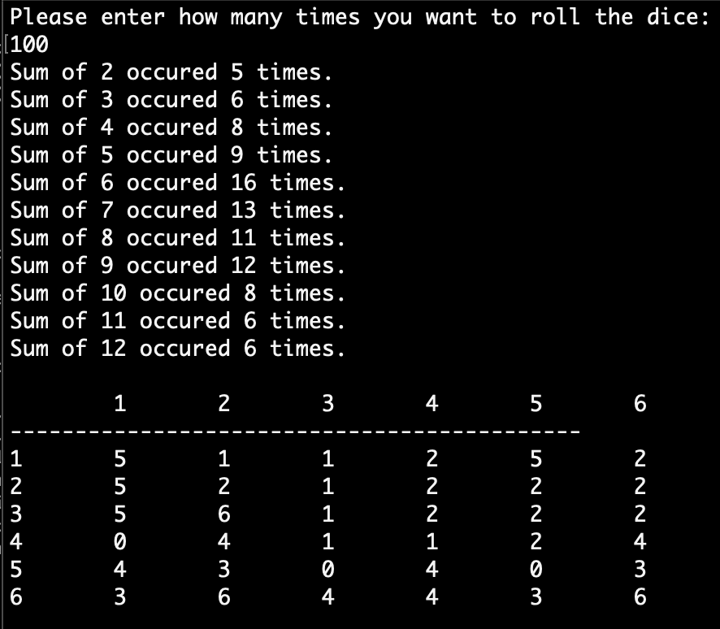
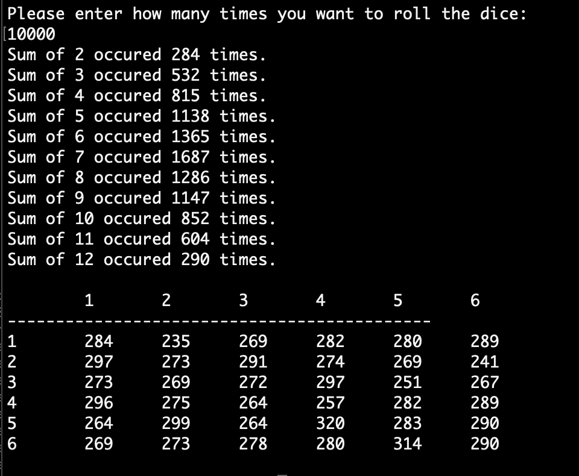

# Roll of Dice

## Instructions
This is a game for the Console showing statistics of sum and frequence for summing up the rolling of two dice.

Open the program in Visual Studio and click play. You are asked to enter the number of times you want the dice to roll and is then presented with the statistics.

## Screenshots

Here are two example screenshots with the result of the game, where 100 and 10.000 times was entered.

## Built with
The project is built in Visual Studio, as a .NET Console Project, with C# as programming language

## Author
* Albert Stjärne (https://github.com/AlbertStjarne)
